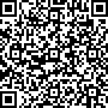
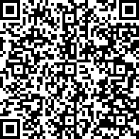
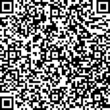

Tokimarks for Verifying Media Files

- [Intro](#intro)
- [What It's Good For](#what-its-good-for)
  - [Tamper-evident Ballot Boxes](#tamper-evident-ballot-boxes)
  - [Monitoring Voting and Vote Counting](#monitoring-voting-and-vote-counting)
  - [Reducing Lying by Politicians and Media Producers](#reducing-lying-by-politicians-and-media-producers)
  - [Sousveillance](#sousveillance)
  - [Random Numbers](#random-numbers)
  - [Data Integrity Checks](#data-integrity-checks)
  - [Digital Signatures](#digital-signatures)
  - [Uploaded Photos](#uploaded-photos)
- [How to Use Tokimarks](#how-to-use-tokimarks)
  - [Make a Tokimark](#make-a-tokimark)
  - [Check a Tokimark](#check-a-tokimark)
  - [Offline Tokimarks](#offline-tokimarks)
  - [Aftermarks](#aftermarks)
  - [Livemarking a Stream](#livemarking-a-stream)
  - [Watching a Livemarked Stream](#watching-a-livemarked-stream)
  - [Verifying a Livemarked Video](#verifying-a-livemarked-video)
- [Data](#data)
  - [Hashing Algorithm](#hashing-algorithm)
  - [Timestamp](#timestamp)
  - [Block](#block)
  - [Tokimark](#tokimark)
  - [Offline Tokimark](#offline-tokimark)
  - [Aftermark](#aftermark)
- [Tokimark Servers](#tokimark-servers)
  - [New-Tokimark RPC](#new-tokimark-rpc)
  - [Get-Containing-Block RPC](#get-containing-block-rpc)
  - [Get-Daymark RPC](#get-daymark-rpc)
  - [Get-Dayblock RPC](#get-dayblock-rpc)
- [Operations](#operations)
  - [Verify a Tokimark](#verify-a-tokimark)
  - [Verify an Offline Tokimark](#verify-an-offline-tokimark)
  - [Make an Aftermark QR Code](#make-an-aftermark-qr-code)
  - [Verify an Aftermark QR Code](#verify-an-aftermark-qr-code)
- [Problems](#problems)
  - [Verification Leak](#verification-leak)
  - [Offline Tokimarks are Imprecise](#offline-tokimarks-are-imprecise)
- [Solved Problems](#solved-problems)
  - [Blocks Are Too Big](#blocks-are-too-big)
  - [Rate Leak](#rate-leak)
  - [Known Upload Leak](#known-upload-leak)
  - [DoS to Control Block Hash](#dos-to-control-block-hash)
- [Alternatives](#alternatives)
- [TO DO](#to-do)

# Intro
It's 2021 and technology lets us make recordings and share them immediately with people anywhere.
But we can't know if those recordings are original, edited, or labeled with the wrong time.

This document shows a way to know that, called 'tokimarking'.
Tokimarking is a way to show that a particular computer file existed at a particular time
and hasn't been modified since then.

# What It's Good For
## Tamper-evident Ballot Boxes
We can build a ballot box with a light and a camera inside that records continuously.
The camera uses mirrors and lenses to see all around the inside of the box.
The camera gets a video of anybody opening the box, putting anything in, and taking anything out.

The camera software puts tokimarks on the video file.
If someone edits the video, the tokimarks won't validate.
If someone edits the video and puts new tokimarks on the file,
the times of the new tokimarks will be wrong (after the election).

For a public election, we can share the video file with the public.
Then anyone can download the video file,
use software on their own computer to validate the tokimarks,
watch the video, and see if the ballot box was handled properly or not.

We can use a tamper-evident box to ship items and detect unauthorized access to it.
For more on this topic, see
[Random Mosaic – Detecting unauthorized physical access with beans, lentils and colored rice](https://dys2p.com/en/2021-12-tamper-evident-protection.html)
([PDF](media/Random_Mosaic_–_Detecting_unauthorized_physical_access_with_beans,_lentils_and_colored_rice.2022-05-24.dys2p.pdf)).

## Monitoring Voting and Vote Counting
Tokimarking video cameras can make a verifiable record of election performance.

1. Record citizens voting at polling places.
2. Record inside the ballot boxes.
3. Record election workers opening the boxes and counting the votes.
4. Publish the videos so anyone can download and check them.

Voters can see video of themselves voting, their ballot in the box,
and the election workers taking it out and counting it.
They will have more confidence in the integrity of their election.

We can do this cheaply with phones and simple tokimarking apps.

## Reducing Lying by Politicians and Media Producers
We put people in prison for
[lying to customers about their products](https://www.justice.gov/criminal-vns/case/dennis-balius)
([PDF](media/United_States_v_Dennis_Balius.2018-09-06.pdf)) or
[lying to investors](https://www.justice.gov/usao-ndga/pr/atlanta-ceo-sentenced-prison-securities-fraud)
([PDF](media/Atlanta_CEO_sentenced_to_prison_for_securities_fraud.2021-08-06.pdf)).
But we don't do this yet for politicians who lie to the citizens they serve or wish to serve.
And we don't do this for media producers who lie to their viewers.

Some politicians and media producers use disinformation (lies) to influence elections.
They edit videos and images to mislead all of us.
- [Trump retweets doctored video of Pelosi to portray her as having 'lost it' - 2019-05-24 Reuters](https://www.reuters.com/article/us-usa-trump-pelosi/trump-retweets-edited-video-of-pelosi-to-portray-her-as-having-lost-it-idUSKCN1SU2CB)
  ([PDF](media/Trump_retweets_doctored_video_of_Pelosi_to_portray_her_as_having_lost_it.2019-05-24.Reuters.pdf))
- [Doctored Political Videos And Social Media - 2019-05-25 NPR](https://www.npr.org/2019/05/25/726941833/doctored-political-videos-and-social-media)
  ([PDF](media/Doctored_Political_Videos_And_Social_Media.2019-05-25.NPR.pdf))
- [Trump tests disinformation policies with new Pelosi video - 2020-02-07 The Verge](https://www.theverge.com/2020/2/7/21128317/nancy-pelosi-donald-trump-disinformation-policy-video-state-of-the-untion)
  ([PDF](media/Trump_tests_disinformation_policies_with_new_Pelosi_video.2020-02-07.The_Verge.pdf))
- [Fox News runs digitally altered images in coverage of Seattle's protests - 2020-06-12 The Seattle Times](https://www.seattletimes.com/seattle-news/politics/fox-news-runs-digitally-altered-images-in-coverage-of-seattles-protests-capitol-hill-autonomous-zone/)
  ([PDF](media/Fox_News_runs_digitally_altered_images_in_coverage_of_Seattle_protests.2020-06-12.The_Seattle_Times.pdf))
- [Trump shares doctored video of Biden with 'manipulated media' Twitter tag - 2020-09-16 Politico](https://www.politico.com/news/2020/09/16/trump-doctored-video-joe-biden-twitter-415863)
  ([PDF](media/Trump_shares_doctored_video_of_Biden_with_manipulated_media_Twitter_tag.2020-09-16.Politico.pdf))

They also lie about the time or location of video and images.
- [Trump posts misleading ad using Ukraine photo - 2020-07-22 BBC](https://www.bbc.com/news/world-us-canada-53500610)

We can use tokimarks to check when a video or image was taken and confirm that it was not altered.
Once this technology is easy to use, many journalists and individuals will use it to boost their credibility.
When someone doesn't use a tokimark, we can ask,
"Why should we believe your video is legit when it has no tokimark?"

## Sousveillance
[Sousveillance](https://en.wikipedia.org/wiki/Sousveillance) means "watching from below".
It means citizens watching what their government workers do.

In a democracy, voters grant permission to government workers to do certain things,
and assign them jobs to perform.
People do sousveillance and hold their government workers accountable
for how they use these permissions and how they perform their jobs.

When someone shares a video or photo of a government worker doing something objectionable,
sometimes the worker says that the video is fake.
If the video has a tokimark, then anyone can verify the time the video was taken
and check if it has been modified since then.
The tokimark helps people to trust that the video is real.

## Random Numbers
When an app adds a tokimark to a file, it first creates a short scrambled computer code from the file.
This is called a 'hash'.
It sends the hash to a public tokimark server.

Each public tokimark server receives hashes from many apps and from other tokimark servers.
Every second, it combines all the hashes together to make a new hash.

No-one can predict or force a hash.
We can use the hashes as random numbers in lotteries.

A lottery organizer can publish ahead of time that they will use the hashes produced by a particular set of servers
at a particular time as input to a particular very slow algorithm to select the lottery winners.
Afterward, anyone can verify that the lottery organizers followed the process correctly.

Scientists can pre-register the future tokimark hashes they will use as random numbers in experiments.
They can also publish the tokimark of their input data before randomizing their data.
These practices can reduce
[fraud in medical research](https://blogs.bmj.com/bmj/2021/07/05/time-to-assume-that-health-research-is-fraudulent-until-proved-otherwise/).

## Data Integrity Checks
Sometimes hackers connect to computers and change or destroy data.
Organizations can use tokimarks to know if their computer data has been changed or destroyed.

## Digital Signatures
Digital signatures rely on public key cryptography which is susceptible to advances in technology.
We cannot trust very old signatures because someone could
discover an old key and then sign a new document with it.

This is why every public key has an expiration date.
A signature lasts only as long as its public key.

But we can trust a very old signature if it has a tokimark from when the public key was still valid.

Tokimarks let us de-couple signature validity from key validity.
This makes digital signatures more useful.

## Uploaded Photos
A person can use an app to display a tokimark as a QR code.
When they take a photo, they can include this QR code in the photo.
Later, other people can use software to check the tokimark in the QR code.
If the tokimark is valid, the person can be pretty sure that the photo was taken after the tokimark.
We call the tokimark an 'aftermark'.

Managers of hotels and rental housing often use old photos in online ads.
Customers cannot trust uploaded photos to show the real condition of the property.
If uploaded photos include aftermarks, customers can know the age of the photo.
If the photo was taken very recently, they can trust it to show the real condition of the property.

Aftermarks increase the credibility of uploaded photos and videos
of things that change in appearance or quality over time.
Examples: hotels, housing, used vehicles, mass-produced products, and dating profiles.

# How to Use Tokimarks
## Make a Tokimark
You can take a photo or video with an app that supports tokimarking.
After you take the photo or video, the app calculates a short scrambled 'hash' code for the file
and sends the hash to a public tokimark server.
The server sends back the tokimark.
The app adds the tokimark to the end of the file.
This takes about a second.
The tokimark makes the file about N% bigger (TODO: Update with real number).

You can use software to add a tokimark to a document.
If you change the document, the tokimark becomes invalid.
Your document editing software will warn you about this if you try to edit a document
that has a tokimark.
The tokimark makes the document file about N% bigger (TODO: Update with real number).

If your document editor does not support tokimarks,
you can use another software program to make and save a tokimark file.

File storage services will include Tokimark support.
When you upload a document, the app automatically makes a tokimark.
If you have a tokimark for the document in a tokimark file, you can upload the document and tokimark file together.

## Check a Tokimark
You use software to verify a document's tokimark.
When the software says the tokimark is good, then you can be sure of two things:
1. The document existed at the time the tokimark was made.
2. The document is unchanged.  It has not been altered since the tokimark was made.

When a tokimarked document is on a public website, your web browser verifies it automatically.
You must open the document in a new tab.
The browser bar will show the date, eg "Tokimark 2021-01-06 14:11 EST".

When someone shares a document with you on a file-sharing service,
you can get the document with an app on your phone or computer.
The app gets the tokimark and verifies it automatically.

When someone emails you a document, they can also attach the tokimark file.
Your email software verifies it automatically.

When you have a document and a tokimark file on your computer, make sure you have verifier software,
then select the file and choose "Verify Tokimark".
Your computer must be connected to the Internet for this to work.

## Offline Tokimarks
When you use software to check a tokimark, the software must connect to the Internet to download some data.
You can use software to download this data and add it to the tokimark.
We call this kind of tokimark an "offline tokimark".
Later, you can verify it without connecting to the Internet.

You can't make a tokimark and then make it offline right away.  You must wait until the next day.
This is because tokimark servers prepare the data once a day.

## Aftermarks
You can download a code from the Internet and include it in your video or photo as an 'aftermark'.
Every tokimark server makes a new aftermark once a second.
Nobody can predict what the aftermark will be.

If you find an aftermark in a photo, you can be sure that the photo was taken after the aftermark.
You can use software to check the time of the aftermark.
The software connects to the Internet, to a public tokimark server.

If the photo also has a tokimark,
you can be sure that the photo was taken between the aftermark time and the tokimark time.

You can get an app for your phone that displays aftermark QR codes.
Hold the phone up to the camera when you record or stream.
Folks can use software to find out the exact time you recorded your video.

If you're recording audio, you can use an app to play the aftermark as an audio jingle.

Altering a photo or recording to insert an aftermark is very difficult.
The harder it is to alter, the more you can trust the aftermark.
Some things make a photo or video harder to alter.
You can do these things to make your photos & videos harder to alter and therefore more trustworthy:
- Upload the original file created by your camera.  Don't resize or edit it.
- Record high-resolution video and high-quality audio
- Save in raw format or use high quality compression.
  Remember that folks must download the entire file to check the tokimark, so don't make the file too big.
- Include your aftermark in multiple forms:
  QR code, audio jingle, pole with LED strand, spoken, written on clothing/skin, etc.

When you view a photo or video file, the software can find aftermarks automatically and show you the times.

## Livemarking a Stream
When you stream, you use software to record and send it through the Internet.
The software can add a tokimark to the file once a second.
We call this a 'live tokimark'.
Live tokimarks add about 0.02 Mbps (2.5 KB/s) (TODO: Update) to the stream bandwidth.

When you stream video, you can hold up a phone with an app that shows a new aftermark QR code every second.
We call this a 'live aftermark'.

When a video has both a live aftermark and a live tokimark, we say it is 'livemarked'.

You can livemark streaming audio, too.  Use an app to play the live aftermark jingle in the background.
Use the same microphone to capture your voice and the jingle.

## Watching a Livemarked Stream
People use software to watch your stream.
The software sees the live aftermark and shows how many seconds the stream is delayed.
People can be sure that the stream really is live.

This works for livemarked streaming audio, too.

## Verifying a Livemarked Video
You can download a livemarked video and watch it later.
You use software to watch it and check the livemarks.  The software can tell you:
1. The video existed at the time the livemarks were made.
2. The video is unchanged and uncut.  It has not been altered since the livemarks were made.
3. The marking interval.

The marking interval is the time between the aftermark and the tokimark for each section of video.
This is the amount of time that a malicious streamer had to edit each section of video before it was tokimarked.
Five seconds is a normal marking interval.
A very short marking interval means the chance of fakery is slim.

The remainder of this document contains technical details.

# Data
## Hashing Algorithm
Tokimarks use [SHA3-512](https://en.wikipedia.org/wiki/SHA-3).
Every hash is a 64-byte value.
Tokimark format encodes every hash in lower-case hexadecimal.

## Timestamp
Tokimark timestamps are the number of seconds since the epoch, 1970-01-01T00:00:00Z.

Tokimark format encodes every timestamp as a
big-endian 64-bit unsigned integer encoded in lower-case hexadecimal.
It always includes leading zeros.

## Block
A block is a sequence of hashes and a timestamp.
```
$hash0$hash1$hash2...$hashN$timestamp
```

Every hash is a sequence of 64 bytes encoded in lower-case hexadecimal.
Every block must contain 1-447 hashes.

This regular expression matches all valid blocks:
`[0-9a-f]{128}{1,447}[0-9a-f]{16}`.

A tokimark server produces a new block once a second.
It sets the block timestamp to the current time.

The server takes the hash of its previous block and adds it to the new block.
The new block's timestamp must be higher than the previous block's timestamp.

It also gets the latest blocks of other tokimark servers and adds their hashes to the new block.
It adds only hashes of blocks with timestamps that are lower than the new block.
Server blocks form a mesh that the servers continually extend on one side.

Example block with timestamp 2021-10-22T23:18:50Z:
```
381b6048fb92d3426d442e86c38f56e895d96a586caf5877d5638443ccc6c6e52c9b0e4955b10247d942321326e603ba92aea82d1e1fd813ead9aa1cd3f09e54d239776717251703c0d2a106c6863cbe1c056d058df630948c1431ec2deee9ca7eada897ed053dad443b9b8b3ad621eaf499891ed823880b230f4a61a971b2b31187b8a4177e6ef0ab85c063e60213f02d4ad9fbb618752fecc2b5c1783aad526c1ea02faf76193af6a12f5b5ab6fda7c8e1bf06a3d4a1ae5bdc86f25724eda827ada9d5345160db07663f9c6130e7ee169f745c93d969917faa31866aab09dfd5347a51bb359b702f2fc6f8ca1340f505c03c7d304481fae42a24f33975604800000000617346da
```

## Tokimark
A tokimark is a sequence of hashes and a block.
```
e0/tokimark $hash0A$hash0B$hash1B$hash2B...$hashNB $block
```

Every tokimark must contain 1-64 hashes.
Every tokimark is less than 64 KiB in length.

`$hash0A` is the hash of the document's bytes.

This regular expression matches all valid tokimarks:
`e0/tokimark [0-9a-f]{128}{1,64} [0-9a-f]{128}{1,447}[0-9a-f]{16}`.

The hashes form a chain:
- `$hash0A` is the first hash in the chain.
- To calculate `$hash1A`, sort `$hash0A` and `$hash0B`, concatenate them, and calculate the SHA3-512 digest.
  Pseudocode: `$hash1A = sha3_512(concat(sort([$hash0A, $hash0B])))`.
- Calculate `$hash2A` in the same way from `$hash1A` and `$hash1B`.  And so on.
- The final hash (`$hash(N+1)A>`) must appear in `$block`.

Example tokimark:
```
e0/tokimark 5552aa41192b46651fdcb33bdee0d9dd4356307be24ed142089ab615500d1f4e975aae9fd82ee628d466a784722dbf908bab736a761457ad69eb3e19b9a57c6f1b4366dac0d37f37b1cf4a85441045b3a22ba572c11d99c7a8f2356b6ea54851162405989eeb786a7384561d0be7c61152de87c260def9873ca536aee666a77dd715729eb9bce054594591393ed03b7123000ff2b5fa75b9ce89c4e31bbbf7b44e5258b81fdf34c97dfb920b1f50b5da410b45f5319ef2c50c784e2be26d31d71770d773492920c7c9e6dba3d67f08e1090f611d6da8e9a34d11b3d3701f745020e93eae07858d066f4d9a3e88634550df992f73400aa5a31adfa5d9d2324535 381b6048fb92d3426d442e86c38f56e895d96a586caf5877d5638443ccc6c6e52c9b0e4955b10247d942321326e603ba92aea82d1e1fd813ead9aa1cd3f09e54d239776717251703c0d2a106c6863cbe1c056d058df630948c1431ec2deee9ca7eada897ed053dad443b9b8b3ad621eaf499891ed823880b230f4a61a971b2b31187b8a4177e6ef0ab85c063e60213f02d4ad9fbb618752fecc2b5c1783aad526c1ea02faf76193af6a12f5b5ab6fda7c8e1bf06a3d4a1ae5bdc86f25724eda827ada9d5345160db07663f9c6130e7ee169f745c93d969917faa31866aab09dfd5347a51bb359b702f2fc6f8ca1340f505c03c7d304481fae42a24f33975604800000000617346da
```

## Offline Tokimark
Once a day, each tokimark server makes a tokimark for every block it created in the previous 24 hours.
We call the tokimark for a particular block its 'daymark'.
The tokimarks all have the same block, called the 'dayblock'.

A client can use the Get-Daymark RPC to download the daymark for a tokimark block.
It stores the tokimark and daymark together.
We call such a tokimark an "offline tokimark".

Offline tokimark format:
```
e0/tokimark $tokimark\n$daymark`
```

Example offline tokimark:
```
e0/tokimark 5552aa41192b46651fdcb33bdee0d9dd4356307be24ed142089ab615500d1f4e975aae9fd82ee628d466a784722dbf908bab736a761457ad69eb3e19b9a57c6f1b4366dac0d37f37b1cf4a85441045b3a22ba572c11d99c7a8f2356b6ea54851162405989eeb786a7384561d0be7c61152de87c260def9873ca536aee666a77dd715729eb9bce054594591393ed03b7123000ff2b5fa75b9ce89c4e31bbbf7b44e5258b81fdf34c97dfb920b1f50b5da410b45f5319ef2c50c784e2be26d31d71770d773492920c7c9e6dba3d67f08e1090f611d6da8e9a34d11b3d3701f745020e93eae07858d066f4d9a3e88634550df992f73400aa5a31adfa5d9d2324535 381b6048fb92d3426d442e86c38f56e895d96a586caf5877d5638443ccc6c6e52c9b0e4955b10247d942321326e603ba92aea82d1e1fd813ead9aa1cd3f09e54d239776717251703c0d2a106c6863cbe1c056d058df630948c1431ec2deee9ca7eada897ed053dad443b9b8b3ad621eaf499891ed823880b230f4a61a971b2b31187b8a4177e6ef0ab85c063e60213f02d4ad9fbb618752fecc2b5c1783aad526c1ea02faf76193af6a12f5b5ab6fda7c8e1bf06a3d4a1ae5bdc86f25724eda827ada9d5345160db07663f9c6130e7ee169f745c93d969917faa31866aab09dfd5347a51bb359b702f2fc6f8ca1340f505c03c7d304481fae42a24f33975604800000000617346da\n
fe310de4fa470a31ba73be2ee24d02ec239893701a9bdd7c68e658272dbe486553693248a0a2bdb2dfc55500ce173b5751969e67c5e4037d0a77e76a82fe12de2850a51dc9483a28f4cdd3c805c333b2ba8508297daa101cc63e27a5fa101b188dc9ef130bac2611c1b9ddebdc137c5a242e3f92340f537408df17dea2e3b69a3e4fff3b613e33f99973b0206de4d5eb14f5ed75c320495e03c209ade164a40e4e890b86137687c079792c79b66be4f17f3a9279c064e3cdac136ded1398d313 09806998cd4d961cc1d72ddf1742b35048e812fe406a1852ff55e1b96f3a823b4b6ed9c00b858e794690addf2817b135132b0a525b45d6c5eee752ee0e250c1cb388e31765ca23427f79b0f81aaf9899af83da0bb87d69c671fecf3e515b739ab503322cd7c67f6e463e565a84ba43c0034a1e33d8bf8184e9ea9c47ee3c87588b6155c15ae1a8e158a10fb21313fa7176b2d6164092d003bef3db083658a4f79c7acb9391270dfe57c64fb758880bca1311f66c144682e15fb4c781e27258df596a5c1f15e9ad9ba4d19ecf15f0876eee472e6ccc6f44c34b2f1e292947a80aca14a594487515de4bfd5fa931e4e91f8265febae2c1b82b9e57763679e2de000000000061735080
```

## Aftermark
An aftermark is a sequence of bytes with the following format:
```
e0/after $hash_base64$timestamp_base64
```

`$hash_base64` is the 64-byte hash of a Tokimark block,
encoded in [Base64](https://en.wikipedia.org/wiki/Base64), with no padding.
This yields 86 characters.

`$timestamp` is the timestamp of the same block,
encoded as a big-endian 64-bit unsigned integer and then encoded in Base64.
This yields 11 characters.

Every aftermark is 106 characters long.

This regular expression matches all valid aftermarks:
`e0/after [A-Za-z0-9+/]{86}[A-Za-z0-9+/]{11}`.

Example aftermark for the block hash
`fe310de4fa470a31ba73be2ee24d02ec239893701a9bdd7c68e658272dbe486553693248a0a2bdb2dfc55500ce173b5751969e67c5e4037d0a77e76a82fe12de`
and timestamp `00000000617346da`:
```
e0/after /jEN5PpHCjG6c74u4k0C7COYk3Aam918aOZYJy2+SGVTaTJIoKK9st/FVQDOFztXUZaeZ8XkA30Kd+dqgv4S3gAAAABhc0ba
```

# Tokimark Servers
Tokimark servers listen on TCP port N (TODO: Update with real port number).

Client machines can connect to a tokimark server and perform RPCs to make and verify tokimarks.

Most tokimark servers are public and provide service to any machine on the Internet.

Every tokimark server is independent.

Tokimark servers connect to other servers and call the same RPCs as clients.
There is no special protocol for server-server connections.

## New-Tokimark RPC
To make a new tokimark for a document, the client follows this process:
1. Calculate the SHA3-512 digest of the document's bytes.  We call this value `$doc_hash`.
2. Generate a random 64-byte value: `$nonce`
3. Sort `$doc_hash` and `$nonce`, concatenate them, calculate the SHA3-512 digest.
   Pseudocode: `$hash = lower_hex(sha3_512(concat(sort([$doc_hash, $nonce]))))`.
4. Connect to the server's TCP port and send the request:
```
e0/tokimark-new $hash\n
```

This regular expression matches all valid New-Tokimark RPC requests:
`e0/tokimark-new [0-9a-f]{128}\n`.

Example request for the document "doc0" and a random nonce:
```
e0/tokimark-new a0b0452e66e4bd7e00bfedfc7e8e07b4c6f00cb94c3f239a2fcc5ac684461df804686dc5950ba8b6350fdbc9e45f0c69280f019669dd564973816890498272d7\n
```

The server responds with one of:
- `e0/tokimark $tokimark\n`
- `e0/tokimark-transient-error $error_message\n`
- `e0/tokimark-permanent-error $error_message\n`

`$error_message` is any valid UTF-8 string not containing `\n`.
The string length must be 1-200 bytes.

When the server returns a `tokimark-transient-error`, the client may retry the request after a short delay.
If the server returns consecutive transient errors, the client should increase the delay between requests.
We call this 'backoff'.

When the server returns a `tokimark-permanent-error` response, the client must not retry the request.

When the server returns a `tokimark` response, the tokimark must contain 1-63 hashes.
The client replaces the first hash with `$doc_hash` followed by `$nonce`.

Example response:
```
e0/tokimark a0b0452e66e4bd7e00bfedfc7e8e07b4c6f00cb94c3f239a2fcc5ac684461df804686dc5950ba8b6350fdbc9e45f0c69280f019669dd564973816890498272d7d715729eb9bce054594591393ed03b7123000ff2b5fa75b9ce89c4e31bbbf7b44e5258b81fdf34c97dfb920b1f50b5da410b45f5319ef2c50c784e2be26d31d71770d773492920c7c9e6dba3d67f08e1090f611d6da8e9a34d11b3d3701f745020e93eae07858d066f4d9a3e88634550df992f73400aa5a31adfa5d9d2324535 381b6048fb92d3426d442e86c38f56e895d96a586caf5877d5638443ccc6c6e52c9b0e4955b10247d942321326e603ba92aea82d1e1fd813ead9aa1cd3f09e54d239776717251703c0d2a106c6863cbe1c056d058df630948c1431ec2deee9ca7eada897ed053dad443b9b8b3ad621eaf499891ed823880b230f4a61a971b2b31187b8a4177e6ef0ab85c063e60213f02d4ad9fbb618752fecc2b5c1783aad526c1ea02faf76193af6a12f5b5ab6fda7c8e1bf06a3d4a1ae5bdc86f25724eda827ada9d5345160db07663f9c6130e7ee169f745c93d969917faa31866aab09dfd5347a51bb359b702f2fc6f8ca1340f505c03c7d304481fae42a24f33975604800000000617346da\n
```

## Get-Containing-Block RPC
To retrieve a server's block that contains a particular hash,
the client connects to the server's TCP port and sends this request:

```
e0/tokimark-get-containing-block $hash$timestamp\n
```

`$hash` is any hash.

`$timestamp` is the time when the hash was created.
The server will return a block with a timestamp that is `$timestamp` or higher.

This regular expression matches all valid Get-Containing-Block RPC requests:
`e0/tokimark-get-containing-block [0-9a-f]{128}[0-9a-f]{16}\n`.

The server responds with one of:
- `e0/tokimark-block $block\n`
- `e0/tokimark-not-found\n`
- `e0/tokimark-transient-error $error_message\n`
- `e0/tokimark-permanent-error $error_message\n`

If the client retries after receiving `tokimark-not-found`, it must use backoff.

Example request:
```
e0/tokimark-get-containing-block fe310de4fa470a31ba73be2ee24d02ec239893701a9bdd7c68e658272dbe486553693248a0a2bdb2dfc55500ce173b5751969e67c5e4037d0a77e76a82fe12de00000000617346da\n
```
Example response:
```
e0/tokimark-block 09806998cd4d961cc1d72ddf1742b35048e812fe406a1852ff55e1b96f3a823b4b6ed9c00b858e794690addf2817b135132b0a525b45d6c5eee752ee0e250c1cfe310de4fa470a31ba73be2ee24d02ec239893701a9bdd7c68e658272dbe486553693248a0a2bdb2dfc55500ce173b5751969e67c5e4037d0a77e76a82fe12deb388e31765ca23427f79b0f81aaf9899af83da0bb87d69c671fecf3e515b739ab503322cd7c67f6e463e565a84ba43c0034a1e33d8bf8184e9ea9c47ee3c87588b6155c15ae1a8e158a10fb21313fa7176b2d6164092d003bef3db083658a4f79c7acb9391270dfe57c64fb758880bca1311f66c144682e15fb4c781e27258df99adc231b045331e514a516b4b7680f588e3823213abe901738bc3ad67b2f6fcb3c64efb93d18002588d3ccc1a49efbae1ce20cb43df36b38651f11fa75678e80000000061735081\n
```

## Get-Daymark RPC
To get a daymark for a tokimark, the client connects to any trusted server's TCP port and sends this request:
```
e0/tokimark-get-daymark $timestamp\n
```

`$timestamp` is the tokimark block timestamp.

This regular expression matches all valid Get-Daymark RPC requests:
`e0/tokimark-get-daymark [0-9a-f]{16}\n`.

The server responds with one of:
- `e0/tokimark $tokimark\n`
- `e0/tokimark-not-found\n`
- `e0/tokimark-pending $timestamp\n`
- `e0/tokimark-transient-error $error_message\n`
- `e0/tokimark-permanent-error $error_message\n`

If the client retries after receiving `e0/tokimark-pending`, it must do so at or after `$timestamp`.

Example request:
```
e0/tokimark-get-daymark 00000000617346da\n
```

Example response:
```
e0/tokimark fe310de4fa470a31ba73be2ee24d02ec239893701a9bdd7c68e658272dbe486553693248a0a2bdb2dfc55500ce173b5751969e67c5e4037d0a77e76a82fe12de2850a51dc9483a28f4cdd3c805c333b2ba8508297daa101cc63e27a5fa101b188dc9ef130bac2611c1b9ddebdc137c5a242e3f92340f537408df17dea2e3b69a3e4fff3b613e33f99973b0206de4d5eb14f5ed75c320495e03c209ade164a40e4e890b86137687c079792c79b66be4f17f3a9279c064e3cdac136ded1398d313 2b0941be0001507470a0c3c95dee2986038a691d5b71011521eccb98f24821d340490a5bcc4acc30d2997f594ec51b2422000aedfd206cc3e46524779331b5d2a30d1d1184b17ff5f3b38ffc9966ed27bf00dc739589d2634d20aa736254e46d8ad4cc13ea773becd2ec7e3a14e09e67ef9e1473fb368c3fd8cfb8ab497fc917ad4a0adeb0f65cc8903bb9bcb87ca2bc4ea9af2926519d0ec6a022add67272ceffe20d28c0417237c13a42a1d70263b9d7f9540c105d3b1033b1369a0341b49a596a5c1f15e9ad9ba4d19ecf15f0876eee472e6ccc6f44c34b2f1e292947a80aca14a594487515de4bfd5fa931e4e91f8265febae2c1b82b9e57763679e2de000000000061735080\n
```

## Get-Dayblock RPC
TODO: Remove.

To get the dayblock for any tokimarks created at a particular time,
the client connects to the server's TCP port and sends this request:

```
e0/tokimark-get-dayblock $timestamp\n
```

This regular expression matches all valid Get-Daymark RPC requests:
`e0/tokimark-get-daymark [0-9a-f]{16}\n`.

The server responds with one of:
- `e0/tokimark-block $block\n`
- `e0/tokimark-not-found\n`
- `e0/tokimark-pending $timestamp\n`
- `e0/tokimark-transient-error $error_message\n`
- `e0/tokimark-permanent-error $error_message\n`

Example request:
```
e0/tokimark-get-dayblock 00000000617346da\n
```

Example response:
```
e0/tokimark-block 2b0941be0001507470a0c3c95dee2986038a691d5b71011521eccb98f24821d340490a5bcc4acc30d2997f594ec51b2422000aedfd206cc3e46524779331b5d2a30d1d1184b17ff5f3b38ffc9966ed27bf00dc739589d2634d20aa736254e46d8ad4cc13ea773becd2ec7e3a14e09e67ef9e1473fb368c3fd8cfb8ab497fc917ad4a0adeb0f65cc8903bb9bcb87ca2bc4ea9af2926519d0ec6a022add67272ceffe20d28c0417237c13a42a1d70263b9d7f9540c105d3b1033b1369a0341b49a596a5c1f15e9ad9ba4d19ecf15f0876eee472e6ccc6f44c34b2f1e292947a80aca14a594487515de4bfd5fa931e4e91f8265febae2c1b82b9e57763679e2de000000000061735080\n
```

# Operations
## Verify a Tokimark
A client can verify a tokimark with this procedure:
1. Verify the format of the tokimark.
2. Calculate the root hash.
3. Confirm that the block contains the root hash.
4. Calculate the block hash.
5. Connect to any trusted tokimark server
   and call Get-Containing-Block RPC with the block hash and timestamp.
6. Confirm that the returned block contains the block hash
   and its timestamp is not before the block timestamp.
7. Optionally, repeat with multiple tokimark servers.

## Verify an Offline Tokimark
For one server and day, all the daymarks share a single block.
We call this the 'dayblock'.
A daymark's block is a dayblock.

A client can use the Get-Daymark RPC to download historical daymarks,
extract their dayblocks,
verify them,
and then save (dayblock_hash, timestamp) pairs to use later.

A client verifies an offline tokimark with these steps:
1. Verify the format of the offline tokimark.
2. Calculate the tokimark root hash.
3. Confirm that the tokimark block contains the tokimark root hash.
4. Calculate the tokimark block hash.
5. Calculate the daymark root hash.
6. Confirm that the dayblock contains the daymark root hash.
7. Confirm that the client previously downloaded the dayblock hash and timestamp.

## Make an Aftermark QR Code
To make an aftermark QR code:
1. Use the New-Tokimark RPC to make a tokimark.
2. Create the aftermark from the tokimark block.
3. Encode the aftermark as a [QR code](https://en.wikipedia.org/wiki/QR_code).

Example QR codes containing the example aftermark from [Aftermark](#aftermark) above:
- Type 4L, 33x33 pixels, stores 114 chars, readable with 7% pixels damaged:
  
  
- Type 5M, 37x37 pixels, stores 122 chars, readable with 15% pixels damaged:
  
  
- Type 6Q, 41x41 pixels, stores 108 chars, readable with 25% pixels damaged:
  
  
- Type 8H, 49x49 pixels, stores 122 chars, readable with 30% pixels damaged:
  
  

See [QR Code Data Capacity](https://blog.qr4.nl/page/QR-Code-Data-Capacity.aspx)
and [Morovia Free online QR Code Maker](https://www.morovia.com/free-online-barcode-generator/qrcode-maker.php).

## Verify an Aftermark QR Code
1. Extract the QR code pixels from an image or video frame.  Save the pixels as an image.
2. Decode the QR code in the image to get the aftermark.
3. Decode the aftermark to get the block hash and timestamp.
4. Make a Get-Containing-Block RPC to any trusted server, providing the block hash and timestamp.
5. Confirm that the returned block contains the block hash.
6. Confirm that the returned block's timestamp is after timestamp and within a few seconds of it.

# Problems
## Verification Leak
When a client verifies a tokimark,
it calls Get-Containing-Block RPC and sends the block hash and timestamp to the server.
The server may record this information.

In any of these cases, the server may infer that the client has particular files:
- A file's tokimark may have a block that is very rarely used.
- A collection of tokimarked files will have a particular set of block hashes and timestamps.
- A livemarked media file contains a sequence of tokimarks.

Workaround: Use offline tokimarks.

## Offline Tokimarks are Imprecise
An offline tokimark contains a daymark.
The daymark timestamp may be hours later than the tokimark timestamp.

Daymarks are imprecise and cannot verify marking intervals of livemarked media.

We need a way for the client to trust both timestamps in an offline tokimark.

# Solved Problems
## Blocks Are Too Big
An earlier version of tokimarks added every submitted hash to the next block.
This increased server storage costs.

Blocks could be very large, increasing the size of tokimarks,
increasing storage and data transfer costs for clients.

To reduce the size of the next block,
the tokimark server combines all submitted hashes into a single hash to include in the block.

It combines the hashes using a binary hash tree,
using the submitted hashes for leaves.
It adds the root hash to the block.
Each tokimark is the sequence of hashes which form the path up the tree, from leaf to root.
The hashes are for the elided side-trees.

To keep the tokimark small, the sequence of hashes does not specify
whether a particular hash is the left-hand or right-hand child of the node.
To calculate the hash of a node, we need to know which order to process its child nodes.
We sort them.

## Rate Leak
A person can estimate the number of tokimarks added to a server
by calling New-Tokimark RPC on it once a second.
They can examine the length of the tokimark hash list and
infer the number of tokimarks added in that second.
Archived livemarked recordings may preserve this information for a long time.

To hide this information,
the server must add random hashes to the set of submitted hashes,
to increase the size of the set to some large number.
We call these random values "hash tree padding".
We call the large number the "new tokimark rate limit" or just "rate limit".
Hash tree padding ensures that tokimarks generated at different times have
hash lists of the same length.

To prevent out-of-memory (OOM) conditions, every server must
limit the number of concurrent client connections.
This has the side effect of limiting the rate of New-Tokimark calls.
The server must set its new tokimark rate limit to the
concurrent connection limit, or higher.

Additionally, if a client calls New-Tokimark and then disconnects
before the server creates the new block,
the server must discard the hash that the client submitted.

## Known Upload Leak
When you call New-Tokimark RPC, you must send a hash.
When the hash is the hash of a document,
you are telling the tokimark server that you have the document.
If the server also has a copy of the document (or just its hash),
it can confirm that the hashes match and then record this information.

Additionally, if the server generates a block for only your tokimark or for
your tokimark and some public files, others who also have a copy of the document
can perform the same hash calculation as the server
and find out that the document was tokimarked.
They could perform this analysis years later, using historical blocks.

To work around this,
the client creates a nonce and sends the hash of the nonce and the document's hash.
Since the server and others do not know the nonce,
they cannot check if your tokimark is for a specific document.

## DoS to Control Block Hash
An attacker who can prevent other clients from connecting to a server
could perform a single New-Tokimark request and control the next block hash.
They could use this technique to influence random numbers derived from server blocks.

To prevent this, the server must add a random 64-byte value to the block's hash set.
We call this value the "block nonce".

# Alternatives
- <https://en.wikipedia.org/wiki/Trusted_timestamping>
- [Internet X.509 Public Key Infrastructure Time-Stamp Protocol (TSP) - RFC 3161](https://datatracker.ietf.org/doc/html/rfc3161)
  - Because it relies on trusted certificates, 
    an attacker who obtains the key of any trusted certificate can forge old timestamps.
  - Because it relies on trusted certificates,
    timestamps are valid only while the signing certificate is valid.
  - Because it relies on public-key cryptography, advances in computer technology
    may render all old timestamps non-trustworthy.
  - Uses a text date format, not unix time.
  - [Trusted Time Stamp Management And Security - ANSI X9.95-2016](https://webstore.ansi.org/Standards/ASCX9/ANSIX9952016?source=preview)
    extends RFC 3161.
    Unfortunately, the American National Standards Institute charges USD 100.00
    for the document.
- [Planet's Seal mechanism](https://docs.planet.ink/data/seal/)
  builds a hash tree every 12 hours and includes the root hash in the 
  [Certificate Transparency Public Ledger](https://certificate.transparency.dev).
- <https://opentimestamps.org> includes hashes in the Bitcoin blockchain.
- <https://news.ycombinator.com/item?id=31637150> contains discussion of various alternatives.
- [Zeitgitter](https://github.com/zeitgitter/zeitgitterd) relies on SHA-1
  which is not secure enough.

# TO DO
- Define the "leading edge" of the mesh.  This is the set of blocks for the previous second, issued by healthy
  public servers.
- Make a name for duration between the time when a server creates a block and
  the time when the block is incorporated into the leading edge of the mesh.
- Allow a client to generate a daymark without revealing the block of their tokimark.
- Describe how software makers can compile lists of dayblock hashes to use for verifying offline tokimarks.
  Servers must submit their dayblocks to other public servers.  Software makers should verify this was done.
- Describe how server operators can find other servers to link to.
- Make names for:
  - The list of hashes in a tokimark
  - The set of hashes used to make the hash tree when creating a new block
  - The list of hashes in a block
- Handle the case where a client gets a tokimark from a server and then the server 
  goes offline forever before the client can get a daymark from it.
- Update table of contents
- Offline livemarks.  This is a tokimark with multiple hash sequences and a single block.
  This merges multiple offline tokimarks into one, avoiding duplicating the block which may be 14KB.
- Code initial servers in Python & Rust.  Deploy.
- Apps for non-technical users:
  - iOS
  - Android
  - Windows
  - macOS
- CLI tool
- Libraries
  - Golang
  - Rust
  - Python
  - Java

# Trademark
"Tokimark", "Livemark", and "Aftermark" are trademarks of Michael Leonhard.

I intend to grant free trademark licenses to every project that implements the protocol correctly
and uses good software engineering processes (automated tests, code reviews, up-to-date libraries, etc).

If Tokimark becomes popular, I intend to make a non-profit organization to own the trademarks,
grant free licenses, verify that implementations are compliant, and pursue violators.
